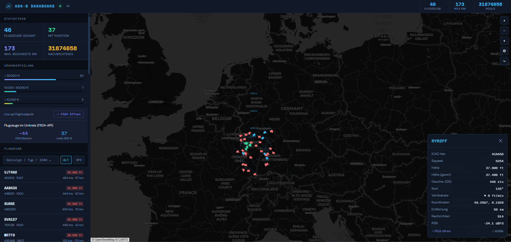

# ✈️ ADS-B Dashboard für Home Assistant

Ein modernes, dunkles ADS-B Radar-Dashboard als Home Assistant Custom Panel — mit Live-Karte, Flugzeug-Liste, Höhenstatistiken und Flightradar24-Integration.



> **Live Demo:** 50+ Flugzeuge in Echtzeit über dem Saarland, 190 km Empfangsreichweite

---

## Features

- **Live-Karte** mit Leaflet.js auf dunklem CartoDB-Hintergrund
- **Echtzeit-Flugzeugdaten** direkt vom `adsb.im` / tar1090-Feed (alle 5 s)
- **Radar-Sweep Animation** im Header mit Live-Status-Dot
- **Flugzeug-Detail-Panel** mit ICAO, Squawk, Höhe, Speed, RSSI, Koordinaten, Vertikalrate
- **Höhenverteilung** (> 30.000 ft / 10.000–30.000 ft / < 10.000 ft) als animierte Balken
- **Reichweitenringe** (50 / 100 / 200 / 300 km, toggle)
- **Flugpfade** (trail der letzten 40 Positionen, toggle)
- **Farbcodierung** nach Höhe: 🟡 Boden · 🟢 niedrig · 🔵 mittel · 🔴 hoch
- **Filterung & Sortierung** nach Callsign / ICAO, sortierbar nach Höhe oder Speed
- **Direktlinks** zu Flightradar24 und ADSBexchange aus dem Detail-Panel
- **Home-Marker** mit eigenem Standort

---

## Voraussetzungen

| Komponente | Info |
|---|---|
| Home Assistant OS | 2023.x oder neuer |
| adsb.im Image auf Pi | aktuell (tar1090 / readsb JSON API) |
| Pi im selben Netz | HTTP-Zugriff vom Browser auf den Pi |

---

## Installation

### 1. Datei in HA ablegen

Öffne den **File Editor** (Add-on) in Home Assistant und lege folgende Ordnerstruktur an:

```
/config/www/adsb-panel/adsb-panel.html
```

Kopiere den kompletten Inhalt der `adsb-panel.html` aus diesem Repo hinein.

> Das Verzeichnis `/config/www/` ist in HA unter `/local/` erreichbar.

### 2. Panel in HA registrieren

**Moderner Weg (empfohlen):**

Einstellungen → Dashboards → ⋮ Menü → Dashboard hinzufügen → **Webseite**

| Feld | Wert |
|---|---|
| Titel | ADS-B Radar |
| Icon | `mdi:radar` |
| URL | `/local/adsb-panel/adsb-panel.html` |

Kein Neustart nötig — das Panel erscheint sofort im Menü.

**Alternativer Weg (configuration.yaml):**

```yaml
panel_iframe:
  adsb_radar:
    title: "ADS-B Radar"
    icon: mdi:radar
    url: /local/adsb-panel/adsb-panel.html
    require_admin: false
```

---

## Konfiguration

Öffne `adsb-panel.html` und passe den `CONFIG`-Block oben im `<script>`-Bereich an:

```javascript
const CONFIG = {
  adsbUrl:    'http://192.168.178.130:1090',  // IP:Port deines adsb.im Pi
  refreshMs:  5000,                            // Aktualisierung in ms
  homeLat:    49.23,                           // Dein Breitengrad
  homeLon:    7.00,                            // Dein Längengrad
  maxRangeKm: 400,                             // Erwartete Maximalreichweite
  mapZoom:    8,                               // Startzoom der Karte
};
```

Den genauen API-Endpunkt deines Pi prüfst du so:
```
http://<pi-ip>:<port>/data/aircraft.json
```
Wenn dort JSON erscheint, stimmt die URL.

---

## CORS-Problem & Fix

Da Home Assistant über HTTPS läuft, aber dein Pi nur HTTP anbietet, blockiert der Browser den Datenabruf im HA-iframe (**Mixed Content**). Das Dashboard funktioniert deshalb am zuverlässigsten wenn du es **direkt** im Browser aufrufst:

```
http://<ha-ip>:8123/local/adsb-panel/adsb-panel.html
```

Diesen Link als Lesezeichen speichern — oder als Kachel auf dem Homescreen des Tablets/Phones.

### Permanenter Fix: Nginx-Proxy auf dem Pi

Installiere Nginx auf dem Pi und richte einen Reverse Proxy mit CORS-Headern ein:

```bash
sudo apt install nginx -y
```

Erstelle `/etc/nginx/sites-available/adsb-cors`:

```nginx
server {
    listen 1091;

    location / {
        proxy_pass http://127.0.0.1:1090;

        add_header 'Access-Control-Allow-Origin' '*' always;
        add_header 'Access-Control-Allow-Methods' 'GET, OPTIONS' always;
        add_header 'Access-Control-Allow-Headers' 'Content-Type' always;

        if ($request_method = OPTIONS) {
            return 204;
        }
    }
}
```

```bash
sudo ln -s /etc/nginx/sites-available/adsb-cors /etc/nginx/sites-enabled/
sudo nginx -t && sudo systemctl reload nginx
```

Dann in `adsb-panel.html` den Port auf `1091` ändern:
```javascript
adsbUrl: 'http://192.168.178.130:1091',
```

---

## adsb.im API-Endpunkte

| Endpunkt | Beschreibung |
|---|---|
| `/data/aircraft.json` | Alle aktuellen Flugzeuge (live) |
| `/data/receiver.json` | Empfänger-Metadaten |

---

## Bedienung

| Aktion | Funktion |
|---|---|
| Klick auf Flugzeugicon | Detail-Panel öffnen, Karte zentrieren |
| Klick auf Listeneintrag | Dasselbe |
| `◎` Button | Reichweitenringe ein/aus |
| `∿` Button | Flugpfade ein/aus |
| `⌖` Button | Ansicht zurücksetzen |
| Filter-Eingabe | Suche nach Callsign oder ICAO |
| ALT / SPD | Sortierung umschalten |

---

## Lizenz

MIT — frei nutzbar, veränderbar, teilbar.

---

## Credits

- [Leaflet.js](https://leafletjs.com/) — Karten
- [CartoDB](https://carto.com/) — Dark Tile Layer
- [tar1090](https://github.com/wiedehopf/tar1090) — ADS-B JSON API
- [adsb.im](https://adsb.im/) — Pi Image

---

*Gebaut mit ♥ für Home Assistant · Saarbrücken, Deutschland*
